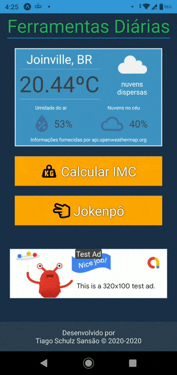
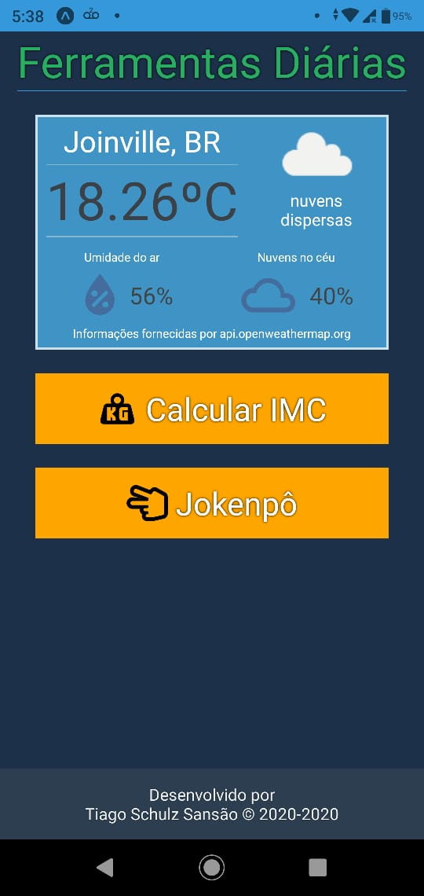

<header>
  

  <h1 align="center"> Diary Tools </h1>
  
 
    <strong> A React Native application with some tools that you may use in your day. </strong> 
  

  
 
    <a href="#about">About</a> •
    <a href="#status">Project status</a> •
    <a href="#preview">Preview</a> •
    <a href="#instalacao">Getting started</a> •
    <a href="#tecnologias">Technologies</a> 
  

  

</header>
<main>

  

    <h3 align="center">💁 About</h3>
    
This application currently has three features:

    <ul>
      <li>Weather forecast (it is shown in degrees Celsius</li>
      <li>BMI Calculator (the units of measurement used are meter and kilogram)</li>
      <li>Jokenpo game (you can play alone or against a friend)</li>
    </ul>
    
You can download it on Google Play Store <a href="https://play.google.com/store/apps/details?id=com.tiagosansao.lifetools">clicking here!</a>

  

  

  

    <h3 align="center">Project status</h3>
    <h4 align="center">
      - The project is finalized! 🎇
    </h4>
  

  

  

    <h3 align="center">Preview</h3>
    
    
  

  

  

    <h3 align="center">💻 Getting started</h3>
    
 :warning: It's necessary to have <a href="https://nodejs.org/en/" target="_blank">Node.JS</a> or <a href="https://classic.yarnpkg.com/en/" target="_blank">Yarn</a> installed to be able to proceed from here; 

<ul><li>Instructions</li></ul>
    
    # Clone the repository
    $ git clone https://github.com/TiagoSansao/Diary-tools

    # Go to the directory
    $ cd Diary-tools/

    # Install all the dependencies
    $ yarn install

    # Start the application
    $ expo start

  
 
    ❗ In order to be able to use the Weather Forecast feature, you will have to create an account on <a href="https://openweathermap.org/api">OpenWeatherMap API</a>, get your private key and create an .env file with this structure: <code>WEATHER_API = {your API key here}</code>, you need to place the equalty sign between spaces, in the same way I showed.
  

  

  

  

    <h3 align="center">🚀 Technologies</h3>
    <ul>
      <li>React</li>
      <li>React-Native</li>
      <li>React-Native-Dotenv</li>
      <li>Expo</li>
      <li><a href="https://openweathermap.org/api">OpenWeatherMap API</a></li>
    </ul>
  

  

  
 🔥 Developed by Tiago Schulz Sansão  👋  <a href="https://www.linkedin.com/in/tiago-schulz-sans%C3%A3o-9283351b7/">Check my LinkedIn

</main>
